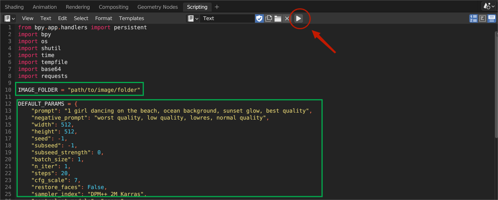

# Blender-ControlNet

A quick demo script for you using ControlNet without leaving Blender.

## Required

- [AUTOMATIC1111/stable-diffusion-webui](https://github.com/AUTOMATIC1111/stable-diffusion-webui)
- [Mikubill/sd-webui-controlnet](https://github.com/Mikubill/sd-webui-controlnet)

## Usage

For now, it's just a quick and hardcoded script, so bear with it.

### 0. Start A1111 in API mode.

### 1. Copy and paste the `demo.py` code into your blender Scripting pane.

### 2. Below is the default params, tweak as you like.

```
DEFAULT_PARAMS = {
    "prompt": "...",
    "negative_prompt": "...",
    "width": 512,
    "height": 512,
    "seed": -1,
    "subseed": -1,
    "subseed_strength": 0,
    "batch_size": 1,
    "n_iter": 1,
    "steps": 20,
    "cfg_scale": 7,
    "restore_faces": False,
    "sampler_index": "DPM++ 2M Karras",
    "controlnet_module": "depth",
    "controlnet_model": "diff_control_sd15_depth_fp16 [978ef0a1]",
    "controlnet_guidance": 1.0,
    "enable_hr": False,
    "denoising_strength": 0.5,
    "hr_scale": 2,
    "hr_upscale": "Latent (bicubic antialiased)",
}
```

and don't forget to modify the image saving folder.

```
IMAGE_FOLDER = "F:\\PATH\\DOESNT\\EXIST\\YET"
```

### 3. Hit "Run Script"



### 4. Hit **F12**, wait for it...

## Roadmap

- [ ] Blender addon
